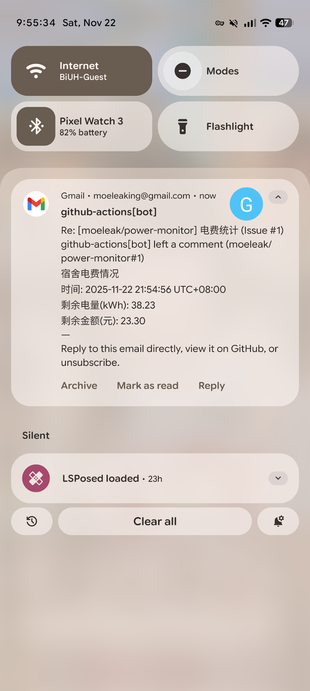
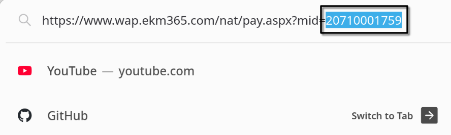

# Power Monitor

效果如下

## 配置指南

fork本项目，用浏览器打开交电费的网站，复制后面的MID

1. 在 **Settings → Secrets and variables → Actions** 中的 `Secrets` 添加
   `Repository secrets`：
   - `POWER_MONITOR_MID` 填刚才复制的 MID
2. 新建一个 Issue 用于接收提醒，例如标题“电费统计”
3. 在 **Settings → Secrets and variables → Actions** 中添加
   `Repository secrets`： `POWER_MONITOR_NOTIFY_ISSUE`，填写 Issue
   的编号（一般第一个issue就是，所以写1就行）

每天将在八点执行。

- 在 Job Summary 中会显示每日电费情况。
- 如果设置了 `POWER_MONITOR_NOTIFY_ISSUE`，使用 `GITHUB_TOKEN` 自动在该 Issue
  下发布评论，从而触发 GitHub 邮件通知。
